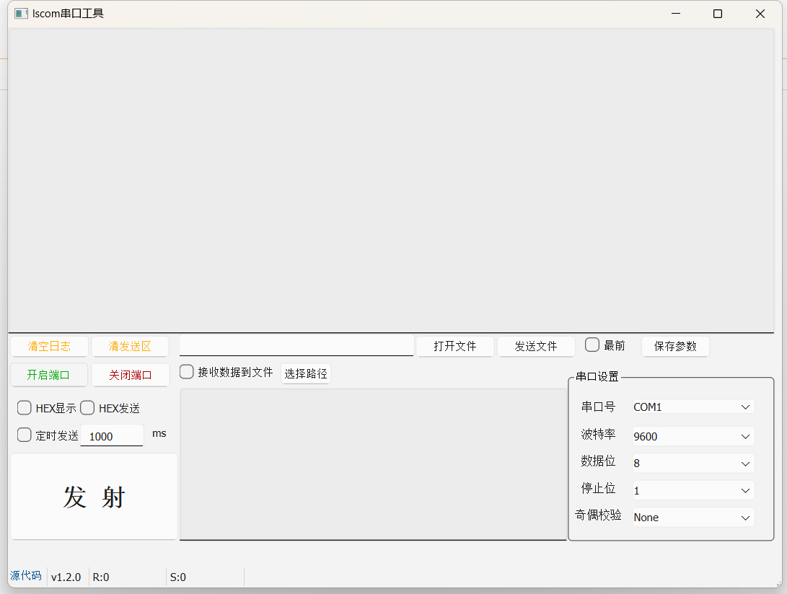

# lscom

#### 介绍
一个使用qt开发的串口工具

#### 软件架构
qt 6

#### 版本迭代方向

1.0版本 使用传统的窗体风格开发串口工具的完整性功能
1.1 实现简单的串口收发功能
1.2 变更界面布局，仿照sscom工具实现（这个版本的迭代会很长） 
后续的版本在1.2上更新迭代（每实现一个模块功能，次版本号+1，变更为1.3 流水版本号累积增加）

2.0版本 使用qml风格开发串口工具，将1.0版本的功能复制到2.0上面，主要是对页面的更改，主体功能逻辑不变

#### 分支管理说明

基础版本master 不再更新
1.0版本中衍生出 base_1_1和 base_1_2 两个分支 分别对应上述提到的1.1版本和1.2版本

#### 界面示例

2.0版本 使用qml风格开发串口工具，将1.0版本的功能复制到2.0上面，主要是对页面的更改，主体功能逻辑不变

-

基础版本master 不再更新
1.0版本中衍生出 base_1_1和 base_1_2 两个分支 分别对应上述提到的1.1版本和1.2版本

1.  Fork 本仓库
2.  新建 Feat_xxx 分支
3.  提交代码
4.  新建 Pull Request（合并到base_1_x分支上面）

#### 创建issues

1.需要标记清楚标签内容、关联里程碑[1.x版本 的第一版发布]、分支、优先级
2.优先级的维护可根功能需求或缺陷的紧急程度维护。

#### 代码提交

要求提交时根据指定的issues进行提交。
示例：
feature:https://gitee.com/hblockd/lscom/issues/IB620C
定时发送
